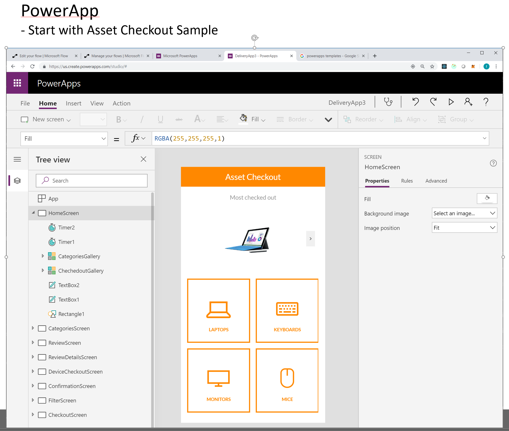
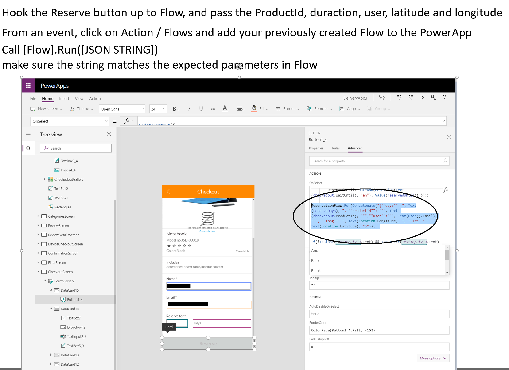
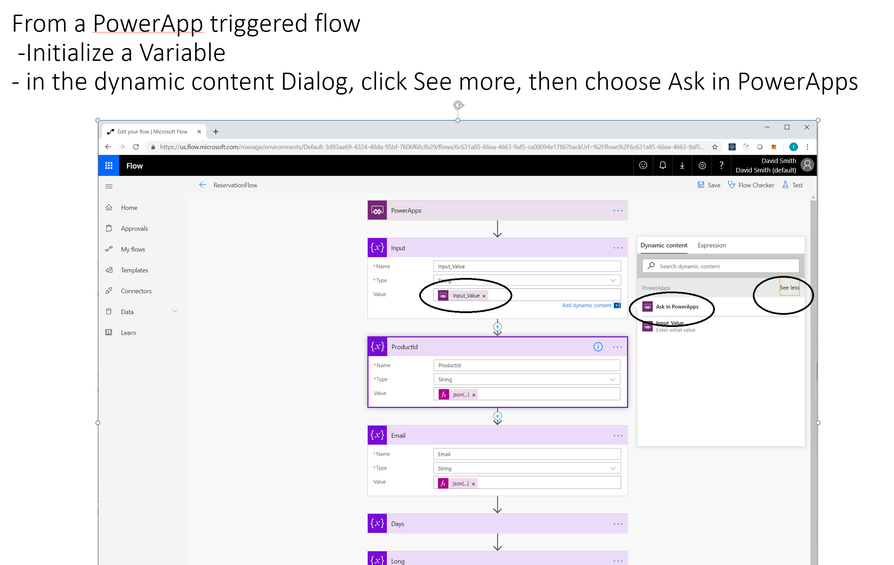
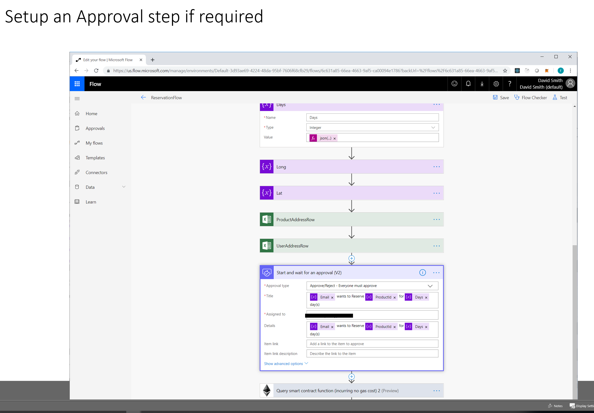
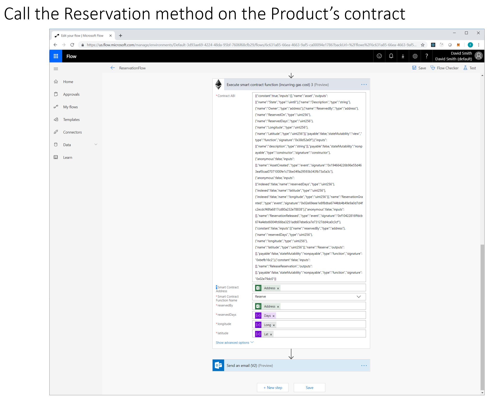
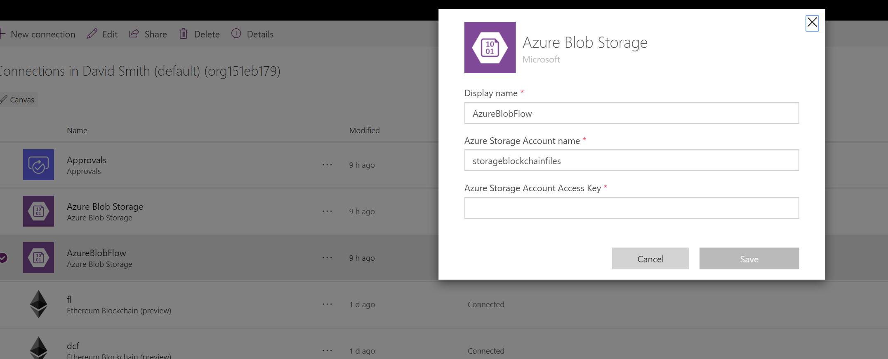
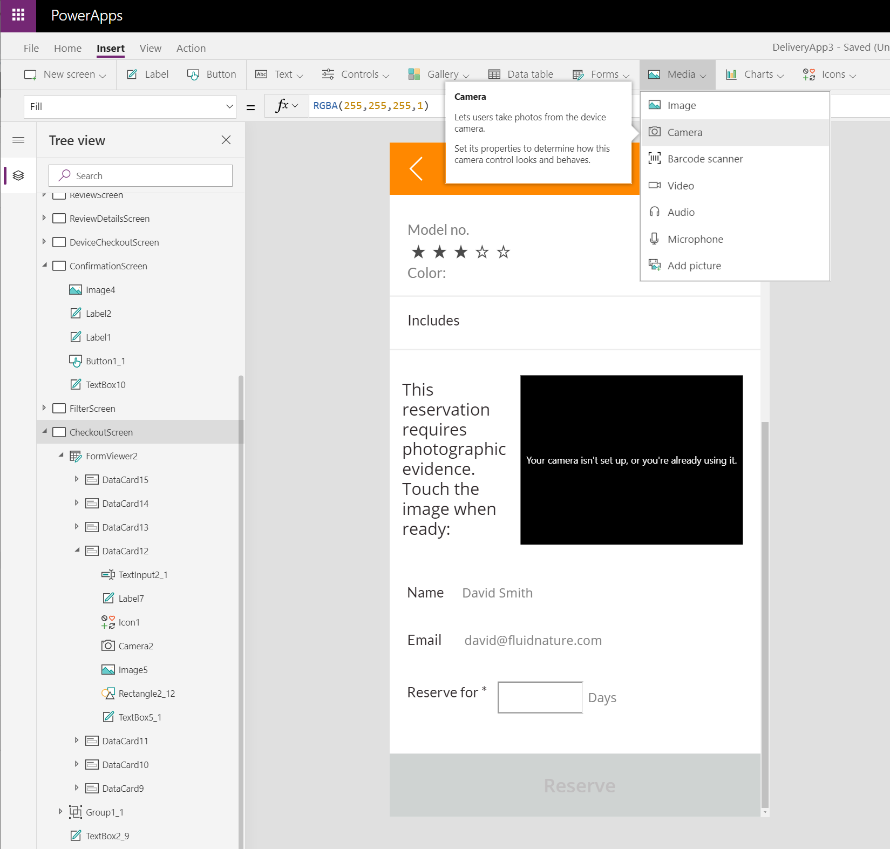
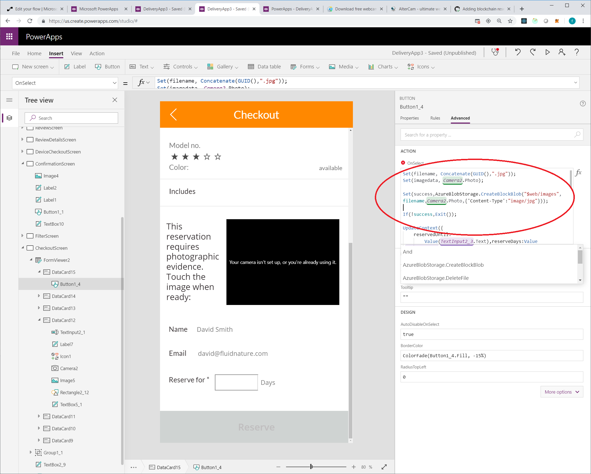

# Ethereum Blockchain Connector - Power App

## Table of contents

1. Overview
2. Creating your own
4. Setting up this sample

## Overview

---

This sample demonstrates:

### Essential:

- Using an Ethereum SmartContract to track an Approval workflow
- Using Ethereum Blockchain Connector, Microsoft Flow and a PowerApps to interact with the SmartContract

### Non-Essential (for the purpose of this sample):

Can be removed in not important or too difficult to setup

- Takes a picture from Camera in PowerApp
- Uploads the picture to the blob and uses the metadata on the blockchain for Attestation
- Uses Microsoft Flow actions to access OneDrive Excel files and send Outlook.com emails (you should use database and non-personal accounts in the real-world)

---

### Technologies

#### Essential tech

- Ethereum Blockchain Connector
- Ethereum Smart Contracts
- PowerApps
- Microsoft Flow 
- Microsoft Office 365 Approvals (from Flow)

#### Other (could be removed)

- Azure BlobStorage
- Office Outlook and OneDrive for Data

---

### Caveats

- This sample assumes the products and the users of the app are predifined on the blockchain (see Setup for instructions)
- For the purposes of simplicity, some data is stored in Excel on OneDrive. In a real scenario, the Microsoft Flow should be refactored for any real-world scenario
- This sample demonstrates both the SmartContract Request and the Approval in the same Flow, with an Office 365 Approval in-between. In a real scenario the Request and Approval would probably be separated.

---

## Sample Files

1. Asset.sol - smart contract
2. ReserveAssetFlow.zip - Microsoft Flow
3. ReserveAssetApp.msapp - Microsoft PowerApp
4. data.xlsx - example spreadsheet with data (in real world, use a database)
5. test-approvals.js - Truffle test file to verify the approval workflow

---

## Asset example

see: ./Asset.sol

- State
    string Description;
    uint Latitude;
    uint Longitude;
    address Owner;
    address RequestedBy;
    uint ReservedDays;
    uint ReservedOn;
    StateType State;

- Methods

  - RequestReservation(requestedBy, numberOfDays, latitude, longitude)

  - ApproveReservation()
     - must be Owner of the Asset

  - ReleaseReservation()
     - unless the Reservation period is over, only the Reservation holder can release the reservation

---

# Creating your own

---

## Steps

### Creating your own Microsoft Flow to automate Ethereum, triggered by PowerApp

1. Create a Flow with a PowerApp Trigger
2. Create "Initialize Variable" action
2. Name the Action "MyInput", and set type to String
3. Focus in the Value box, and the dialog menu will open
4. Click the "See More" link under the search box (on the right).
5. Click the "Ask in PowerApps" link - this will create a variable with the name of the "MyInput_Value"
6. (For ease of use) add additional "Initializer Variable" for each property you are going to send from PowerApps, using expression:

        json(variables('MyInput_Value')).subProperty1

7. Make sure you either pass the blockchain address for the Product and the User from the PowerApp, or use the ProductId and UserEmail to call another datasource or blockchain to lookup the appropriate addresses
8. Add the Ethereum Connector, add the ABI for Asset.sol, add the Product's address, and select the Reserve method

---

### Create your own the PowerApp to trigger the Microsoft Flow

  1. Start with the Asset Checkout sample
  2. From any event, click Action / Flows and add the Flow you previously created
  3. Find the screen with the Reserve button, and edit the event. 
  4. Make sure you have all the necessary properties, formatted as a JSON string
  5. Execute the [FlowApp].Run([JSON_String_With_Required_Params])

        MyFlow.Run("{ ""prop1"": ""value2"" }");

---

## Screenshots

---

---

---

## Flow App

---

---

---

---

# Setting up this Sample

### Data

For the purposes of demonstration, this sample pre-defines some data and stores it on OneDrive. To move the data, replace the Microsoft Flow OneDrive Excel Connector actions with your data source.

1. Products
   - The Products in the App need to be pre-provisioned to the Blockchain
      - After registering each Product, update the data.xlsx Products table with the addresses
      - `IMPORTANT`: for this sample, the `owner` of each Product needs to be the same account used to setup the Ethereum BlockChain Connector in Microsoft Flow.

            // in Truffle (async):
            Asset.new('test', [owner-address]).then(x => x.address)

2. Users
   - The Users of the App (who will request reservations) need to be pre-provisioned Accounts on the Blockchain
      - Open data.xlsx Users table and update the Email, Address and Approver of each User
      - The Email of the Approver must be an Email that belongs to the Office 365 account that you will use to setup the Approvals connection when you setup Microsoft Flow

3. Upload the data.xlsx to OneDrive and update the Microsoft Flow OneDrive Excel actions with the location of the file

---

### Azure Blob Storage

1. You will need the storage account name, folder path and access key from an Azure Block Blob

---

### Microsoft Flow

1. Import the ReserveAssetFlow.zip file
 
2. Setup the data connections.

   - Note: you may need to swap out some of the data connections for different actions.         
      
         Example: the Outlook.com and OneDrive actions and connections do not work with Office 365

3. You must individually reconnect the OneDrive Excel actions with your location

---

### PowerApp

1. The .msapp file can be imported into your PowerApps account. Data connections will need to be setup and re-associated.

2. The PowerApp uses your Location and Camera, they must be approved by your browser / phone
 
3. Many of the connections are shared between Flow and the PowerApp, but they can get out of sync. 

4. You will need to re-associate the Flow with the PowerApp, and then update the code in the PowerApp to use the newly associated Flow.

   - Create a new Screen (trust me). 
   - Click Actions / Flows
   - Click on the Flow you added above
   - Pay attention to the name of the Flow that was added
   - Delete the new Screen
   - Goto the Checkout screen
   - Click on the Reserve Button (you might need to click it twice)
   - Go to the Properties panel and click on Advanced
   - Double click inside the OnSelect event
   - Find the old Flow reference, and replace its name:

         ReservationFlow_1.Run(Concatenate("{""days"": ", Text(reserveDays), ", ""productId"": """, Text(checkedout.ProductId), """,""user"":""", Text(User().Email), """, ""long"": """, Text(Location.Longitude), """, ""lat"": """, Text(Location.Latitude), """, ""photo"":""",filename,"""}"));

---

# Extra Credit 

---

## Take Photo in PowerApp and save it to Azure Blob

   1. In the PowerApp, add AzureBlobStorage connector

   - In Azure, setup a storage account and configure a block blob
   - Enter the Access Key and storageaccountname in the connector setup

   2. Insert Media/Camera object onto a screen in PowerApp
   3. Save the Photo to a variable when an event occurs - simplest is the Camera OnSelect event (when the user taps the picture) 
         set(myphoto, Camera1.Photo)

   4. Send the Photo to Azure using the AzureBlobStorage connector

      - set a filename that you can send to Flow later:

         Set(filename, Concatenate(GUID(),".jpg"));
      
      - call CreateBlobBlob, with the 
         
         Set(success,AzureBlobStorage.CreateBlockBlob("$web/images",filename,Camera2.Photo,{'Content-Type':"image/jpg"}));

   5. Send the Photo filename to the Flow you previously configured, as another key/value pair

---

## In Flow, get the Photo metadata to send to Blockchain

   1. Make sure the same AzureBlobStorage connector is setup for Flow
   2. Add a step to get the photo filename sent from the PowerApp
   3. Add the "Azure Blob Storage / Get Blob Metadata using path" action
   4. Configure the same path to the block blob you saved the file to, and add the filename variable from step 2:

      $web/images/@{variables('photo')}

   5. Configure the smart contract to receive the image ETag or other metadata as needed, from the Blob metadata action

---

## PowerApp - Camera

---

---

---

## Flow - Photo metadata

---

---